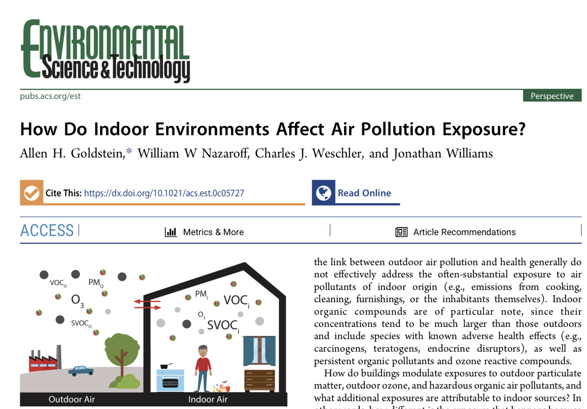
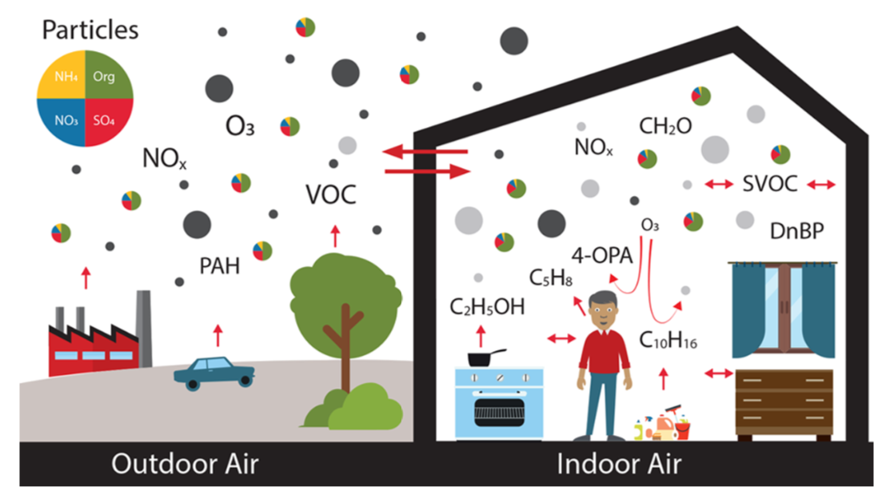
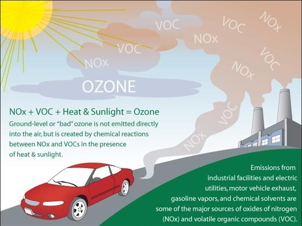
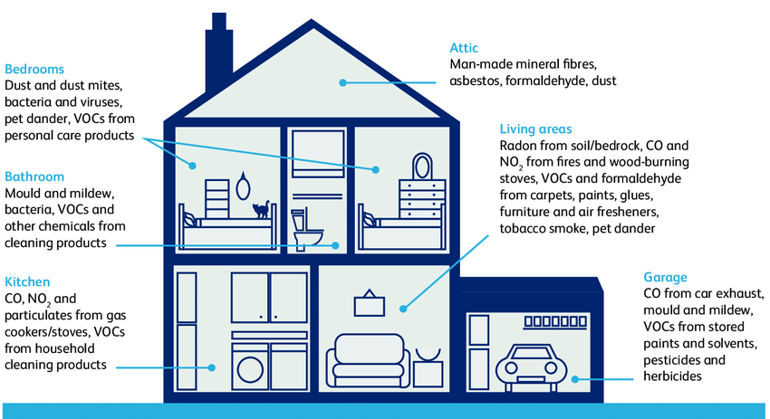

```{r setup, include=FALSE}
options(htmltools.dir.version = FALSE)
```

```{r xaringan-themer, include=FALSE, warning=FALSE}
library(xaringanthemer)
style_duo_accent(
  primary_color = "#45062e",
  secondary_color = "#F1F2EB",
  inverse_header_color = "#303633"
)
```



---
#Background
- Breathing mainly happens indoors, especially at home
- Indoor environments mediate link between outdoor air pollution and human exposure
- Buildings offer partial protection 

--
###How much time do we spend indoors?
--

####87% of time in US
(time apportionment survey)

---
class:center, middle, inverse
#Question 1
###What chemical and physical transformations occur indoors 
that alter the form and composition of outdoor air pollution?
---
.left-column[
- Air borne particles
- Ozone
- Organic air pollutants
]

.right-column[

]

---

*Pie charts indicate fine particle composition. Black circles show ultrafine and coarse particles of outdoor origin. Solid light gray circles represent particles of indoor origin, some of which are transported outdoors. Ozone tends to have a much larger concentration outdoors than indoors, reflecting reactions on indoor surfaces and in air that generate gaseous and condensed-phase products. Multiple indoor sources of organic compounds result in indoor concentrations much larger than those outdoors. Indoor organics partition among the air, airborne particles, room, and human surfaces*
---
# Airborne Particles
###Span diameter range of of 5 orders of magnitudes 
#####(0.001 to 100 microns)
  
1. ####Size selection by buildings  
  - Smallest(ultrafine) and largest (coarse) particles are removed as outdoor particles penetrate building 
  - intermediate (fine) particles remain
  - Therefore, indoor particles of outdoor have narrower size distribution and are the most penetrating and persistent
  
2. ####Change in Chemical Composition
  - Ammonia and nitric acid between gas phase and particle-phase 
  - Shift in concentration of semivolatile organic compounds
      - attach themselves to outdoor origin particles eg. PM2.5
    
???
In summary, several features of indoor environments result in physical and chemical transformations such that indoor particles of outdoor origin differ meaningfully in size distribution and chemical composition from their outdoor precursors. Such changes might well influence the health consequences associated with inhaling them.
---    
    
    
## What are semi/volatile organic compounds?
- Pthalates
- Flame retardents 

---
##Ozone
.pull-left[
- Reacts with surfaces indoors and produces both gases and particles
- Reactions are strongly influenced by indoor moisture
- Indoor ozone is commonly lower than outdoor


*When considering ozone pollution and its health consequences, most studies overlook the indoor exposure to ozone-derived products and their potential contribution to the mortality and morbidity*
 
 ]
 
 .pull-right[

 ]
.footnote[Image:https://www.epa.gov/ground-level-ozone-pollution/ground-level-ozone-basics]
---
##Organic air pollutants
.left-column[
- Several indoor sources

- Result in higher indoor concentrations that are chemically distinct
]
.right-column[

]
.footnote[Holgate ST. ‘Every breath we take: the lifelong impact of air pollution’–a call for action. Clinical Medicine. 2017 Feb;17(1):8.
]
  
---
class:center, middle, inverse
#Question 2
###How do building and human factors influence the nature and extent of modulation of air pollution exposures?
---
##Infiltration factor
- Extent to which buildings are protective
  - indoor-to-outdoor particle concentration ration when all indoor particles originate outdoors
- Infludenced by loss processes
  - deposition to surfaces
  - filtration to mechanical ventilation systems
- Example, 
  - PM2.5 infiltration factor is ~0.5
  - Ozone ~ 0.2 (because it reacts to indoor surfaces)
  - Buildings are more effective in protecting from coarse and fine particles
- Many epidemiological studies ignore attenuation of pollutants by buildings

*Given that buildings generally provide a high degree of protection against ultrafine and coarse particles, combined with significant indoor sources of these modes, we are currently in a state of near blindness about actual inhalation exposure to ultrafine and coarse particles.* 

---
class:center, middle, inverse

#Question 3
###Which air pollutants have indoor sources leading to generally higher concentrations and exposures indoors than outdoors, 
and which of these may be particularly important for health?
---
# Indoor sources
- Ample sources of VOCs and SVOCs
- Human sources (skin flakes, microbes, skin oils, personal care products)
- Ozone sources are uncommon but not rare (photocopiers, electrostatic precipitators)
- Particle sources - cooking, smoking, incense, etc. 
- Secondary sources

####Where is the health risk?
- PM2.5 (equitoxic)
- carcinogenic chemicals (benzene, formaldehyde, acrolein)
- Endocrine disruptors - phthlates, bpa

*1. How indoor emissions and processes affect PM2.5 toxicity is a key question*    
*2. While indoor exposure to endocrine disruptors has increased, the clinical relevance is unknown*

---
# Discussion
- As urban migration increases people will live in more and more confined spaces --> indoor sources will become increasingly important
- More energy efficient, more air conditioning --> lower air exchange
- We have more control over indoor environments than outdoors
  - activated carbon filters for ozone
  - particle filters
  - cleansing practices
  - fuel tramnsition and cooking interventions

---
#Summary
- Most inhalation happens indoors
- Buildings most effectively protetct agains coarse and ultrafine particles
  - important consideration for epi studies for such particles
-  Inhalation of outdoor ozone occurs almost equally outdoors and indoors. Reaction products are more important indoors. 
- Gas-phase organic compounds could be an order of magnitude higher indoors than outdoors (due to indoor sources)
- Outdoor pm2.5 transported indoors absorbs semivolatile organic compunds released from indoor surces. When inhaled, these particles carry the sorbed organics deeper into the respiratory tract than would be the case for the gas-phase counterparts.
